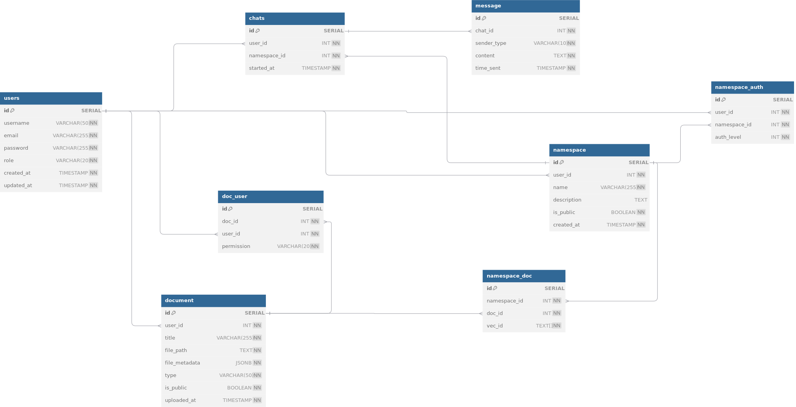

# Luma Database Implementation

Luma uses Postgres to manage relational data. The database stores and manages data related to users and their interactions with Luma, including user accounts, document uploads, and Luma-generated outputs.

---

## Tables

### 1. Users Table
Contains information about user accounts. Includes `id`, `username`, `email`, `password`, and `role`.

### 2. Documents Table
Contains data on documents uploaded by users. Includes `user_id`, `title`, `file_path`, `file_metadata`, and whether the document is made public.

### 3. Doc_User Table
Maps documents to users. Contains `document_id`, `user_id`, and `permission`.

### 4. Chats Table
Contains information about chats between users and Luma. Includes `user_id`, `namespace_id`, and the start time of the interaction.

### 5. Message Table
Contains messages sent by users to Luma. Includes `chat_id`, `sender_type`, `content`, and `time_sent`.

### 6. Namespace Table
Users create namespaces and add documents to them. Chats also belong to namespaces.

### 7. Namespace_Doc Table
Maps documents to specific namespaces and stores corresponding vector IDs for use in document indexing and retrieval.

### 8. Namespace_Auth Table
Stores authorization levels for users within namespaces, where the `auth_level` indicates the type of access (read, write, or admin).

---

## Key Relationships

1. **Users and Documents**: Each document is uploaded by a user (via `user_id` in the `documents` table), and users can have multiple documents.
2. **Users and Doc Permissions**: The `doc_user` table links users to specific documents, with a `permission` field to manage access levels (e.g., read or write).
3. **Chats and Messages**: Each chat is associated with a user and a namespace. Messages are sent within the context of a chat.
4. **Namespaces and Users**: A namespace is owned by a user (via `user_id`), and users can be granted access to namespaces with different authorization levels (via the `namespace_auth` table).
5. **Namespaces and Documents**: Documents can be associated with multiple namespaces, and vector IDs are stored in the `namespace_doc` table for indexing or retrieval.

---

## Detailed Comments

1. **Users Table**:
   - `role`: Describes the role of the user (e.g., admin, user).

2. **Document Table**:
   - `file_path`: Stores the file path to the document on the local system.
   - `file_metadata`: Stores additional metadata about the document, such as file size or original filename.
   - `type`: Specifies the file type (e.g., pdf, docx).
   - `is_public`: Indicates whether the document is public or private.

3. **Doc_User Table**:
   - `permission`: Specifies the user's permission for the document (e.g., read, write).

4. **Chats Table**:
   - `namespace_id`: Refers to the namespace associated with the chat for organizational purposes.

5. **Messages Table**:
   - `sender_type`: Specifies if the message sender is a user or an LLM (Language Model).

6. **Namespace Table**:
   - `is_public`: Indicates whether the namespace is publicly accessible or not.

7. **Namespace_Doc Table**:
   - `vec_id`: Stores the vector IDs corresponding to the documents within the namespace for efficient retrieval.

8. **Namespace_Auth Table**:
   - `auth_level`: Specifies the permission level within the namespace (1 for read-only, 2 for read/write, 3 for full admin).

---

## Database Schema Documentation

### Users Table

| Column      | Type         | Constraints            | Description                                 |
|-------------|--------------|------------------------|---------------------------------------------|
| id          | SERIAL       | PRIMARY KEY            | Unique identifier for each user            |
| username    | VARCHAR(50)  | UNIQUE, NOT NULL       | User's unique username                      |
| email       | VARCHAR(255) | UNIQUE, NOT NULL       | User's email address                        |
| password    | VARCHAR(255) | NOT NULL               | User's password                             |
| role        | VARCHAR(20)  | NOT NULL               | User's role (e.g., 'admin', 'user')         |
| created_at  | TIMESTAMP    | NOT NULL DEFAULT (now())| The time the user was created               |
| updated_at  | TIMESTAMP    | NOT NULL DEFAULT (now())| The time the user's record was last updated|

---

### Document Table

| Column        | Type        | Constraints               | Description                                   |
|---------------|-------------|---------------------------|-----------------------------------------------|
| id            | SERIAL      | PRIMARY KEY               | Unique identifier for each document          |
| user_id       | INT         | NOT NULL                  | Foreign key reference to `users(id)`          |
| title         | VARCHAR(255)| NOT NULL                  | Title of the document                        |
| file_path     | TEXT        | NOT NULL                  | Path to the file on the local system         |
| file_metadata | JSONB       | NOT NULL                  | Additional metadata about the file (e.g., file size)|
| type          | VARCHAR(50) | NOT NULL                  | Type of file (e.g., 'pdf', 'docx')           |
| is_public     | BOOLEAN     | NOT NULL DEFAULT TRUE     | Indicates if the document is public or private|
| uploaded_at   | TIMESTAMP   | NOT NULL                  | The timestamp when the document was uploaded  |

---

### Doc_User Table

| Column      | Type   | Constraints               | Description                                   |
|-------------|--------|---------------------------|-----------------------------------------------|
| id          | SERIAL | PRIMARY KEY               | Unique identifier for the document-user pair |
| doc_id      | INT    | NOT NULL                  | Foreign key reference to `document(id)`       |
| user_id     | INT    | NOT NULL                  | Foreign key reference to `users(id)`          |
| permission  | VARCHAR(20) | NOT NULL               | Permission level (e.g., 'read', 'write')      |

---

### Chats Table

| Column      | Type      | Constraints              | Description                                    |
|-------------|-----------|--------------------------|------------------------------------------------|
| id          | SERIAL    | PRIMARY KEY              | Unique identifier for each chat               |
| user_id     | INT       | NOT NULL                 | Foreign key reference to `users(id)`           |
| namespace_id| INT       | NOT NULL                 | Foreign key reference to `namespace(id)`       |
| started_at  | TIMESTAMP | NOT NULL                 | The timestamp when the chat was started        |

---

### Message Table

| Column      | Type       | Constraints              | Description                                      |
|-------------|------------|--------------------------|--------------------------------------------------|
| id          | SERIAL     | PRIMARY KEY              | Unique identifier for each message              |
| chat_id     | INT        | NOT NULL                 | Foreign key reference to `chats(id)`             |
| sender_type | VARCHAR(10)| NOT NULL                 | Sender type (either 'user' or 'LLM')            |
| content     | TEXT       | NOT NULL                 | The content of the message                      |
| time_sent   | TIMESTAMP  | NOT NULL                 | The timestamp when the message was sent         |

---

### Namespace Table

| Column      | Type       | Constraints             | Description                                   |
|-------------|------------|-------------------------|-----------------------------------------------|
| id          | SERIAL     | PRIMARY KEY             | Unique identifier for each namespace         |
| user_id     | INT        | NOT NULL                | Foreign key reference to `users(id)`          |
| name        | VARCHAR(255)| NOT NULL                | Name of the namespace                         |
| description | TEXT       | NULL                    | Optional description of the namespace         |
| is_public   | BOOLEAN    | NOT NULL DEFAULT FALSE  | Visibility flag (true = public, false = private)|
| created_at  | TIMESTAMP  | NOT NULL DEFAULT (now())| The timestamp when the namespace was created  |

---

### Namespace Doc Table

| Column      | Type       | Constraints               | Description                                   |
|-------------|------------|---------------------------|-----------------------------------------------|
| id          | SERIAL     | PRIMARY KEY               | Unique identifier for the namespace-document pair |
| namespace_id| INT        | NOT NULL                  | Foreign key reference to `namespace(id)`      |
| doc_id      | INT        | NOT NULL                  | Foreign key reference to `document(id)`       |
| vec_id      | TEXT[]     | NOT NULL                  | Array of vector IDs associated with the document |

---

### Namespace Auth Table

| Column      | Type   | Constraints               | Description                                       |
|-------------|--------|---------------------------|---------------------------------------------------|
| id          | SERIAL | PRIMARY KEY               | Unique identifier for each user-namespace permission pair |
| user_id     | INT    | NOT NULL                  | Foreign key reference to `users(id)`              |
| namespace_id| INT    | NOT NULL                  | Foreign key reference to `namespace(id)`          |
| auth_level  | INT    | NOT NULL                  | Authorization level (1: read-only, 2: read/write, 3: full admin) |

---

## Comments

- **users.role**: Describes the role of the user (e.g., admin, user).
- **document.file_path**: Link to the file on the local system.
- **document.file_metadata**: Additional metadata such as file size, original filename.
- **document.type**: Type of the file (e.g., pdf, docx).
- **doc_user.permission**: Permission level for the user on the document (e.g., read, write).
- **chats.user_id**: The user who created the chat.
- **chats.namespace_id**: The namespace to which the chat belongs.
- **message.sender_type**: Indicates whether the message sender is a 'user' or 'LLM'.
- **namespace.is_public**: Indicates whether the namespace is public or private.
- **namespace_doc.vec_id**: Stores corresponding vector record IDs in the vector database.
- **namespace_auth.auth_level**: Defines the level of authorization in the namespace (1: read, 2: read/write, 3: admin).

---

## Foreign Key Constraints

- **document.user_id** references **users.id**
- **doc_user.doc_id** references **document.id**
- **doc_user.user_id** references **users.id**
- **message.chat_id** references **chats.id**
- **chats.user_id** references **users.id**
- **chats.namespace_id** references **namespace.id**
- **namespace.user_id** references **users.id**
- **namespace_doc.namespace_id** references **namespace.id**
- **namespace_doc.doc_id** references **document.id**
- **namespace_auth.user_id** references **users.id**
- **namespace_auth.namespace_id** references **namespace.id**

## ER Diagram
